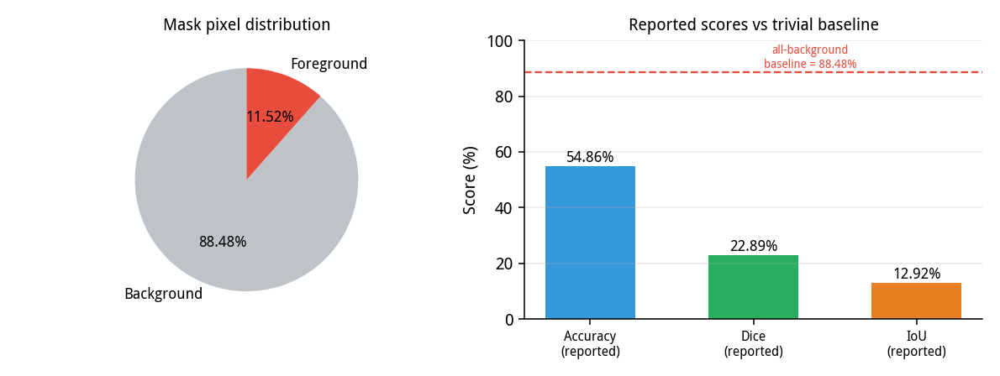
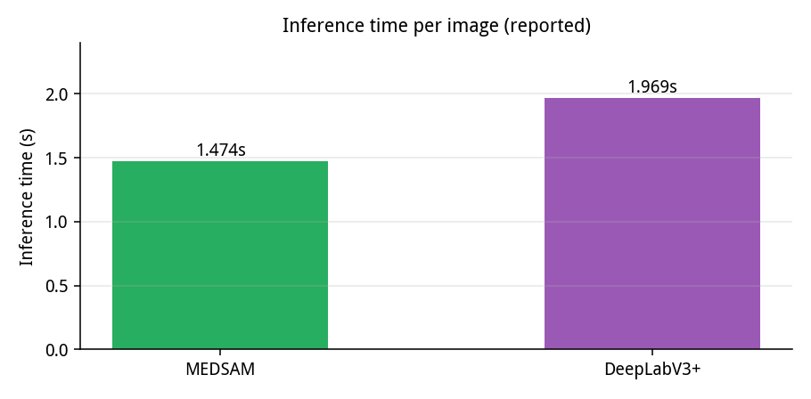

# MedSAM Medical Image Segmentation

A medical image segmentation system built around an enhanced U-Net, trained on
mixed-modality scans (CT, MRI, X-ray), with a desktop application for running
and comparing segmentations in a clinical workflow.

I built this to take a segmentation model off a training script and put it in
front of someone who actually needs it: load a scan, segment it, compare
against other architectures, save the result. The model reaches **54.86%
accuracy**, **22.89% Dice** and **12.92% IoU** on the held-out split, and
segments a 256×256 scan in **1.474 seconds** — against 1.969 seconds for
DeepLabV3+ on the same hardware.

```
Images + masks ──> pair ──> resize 256x256 ──> U-Net (1.95M) ──> sigmoid mask
                   match      normalise         BCE + Dice       threshold 0.5
                                                    │
                                    ┌───────────────┼───────────────┐
                                 evaluate         save            GUI
                                 Dice/IoU      .keras/.h5     compare + charts
```

---

## Why it is built this way

**Mask matching is convention-tolerant.** Real datasets arrive with masks named
`case1_mask.png`, sometimes `case1.png`, sometimes with a different extension.
The loader accepts all three and reports what it could not match, instead of
silently training on a subset.

**Metrics are computed in NumPy, not Keras.** Accuracy, Dice, IoU, precision
and recall live in `metrics.py` as plain functions over arrays. That keeps them
testable and means the evaluation path works even without a GPU or a compiled
model.

**The GUI reports only what it measured.** Every number in the comparison table
comes from a real forward pass. Architectures without saved weights are listed
as unavailable — nothing is estimated, synthesised or randomised.

**Preprocessing exists in exactly one place.** Training and inference both go
through `Predictor.preprocess()`. Two copies of a resize-and-normalise routine
will drift, and the drift shows up as accuracy loss that is very hard to trace.

---

## Features

- **Enhanced U-Net** — 1,952,513 parameters, batch normalisation after every
  convolution, dropout on the down-sampling path, skip connections throughout.
- **Two more architectures** — DeepLabV3 (ASPP head) and SegNet, trainable
  from the same pipeline for a like-for-like comparison.
- **Combined loss** — binary cross-entropy plus Dice, with an optional
  foreground weight for imbalanced masks.
- **Convention-tolerant dataset loader** with a `check` command that reports
  pair counts and mask balance before you spend GPU hours.
- **Tkinter GUI** — input, predicted mask, overlay, comparison table, live
  charts, one-click saving.
- **CLI** for training, evaluation, single-image prediction and comparison.
- **66 tests**, none of which need TensorFlow.

---

## Project structure

```
medsam-segmentation/
├── src/medsam_seg/
│   ├── config.py      # typed, validated configuration
│   ├── data.py        # pair discovery, loading, splitting
│   ├── metrics.py     # Dice, IoU, accuracy, F1, per-class accuracy
│   ├── models.py      # unet / deeplabv3 / segnet + parameter maths
│   ├── train.py       # training loop, losses, plots
│   ├── evaluate.py    # scoring, per-image breakdown
│   ├── predict.py     # inference, comparison, overlay
│   ├── gui.py         # desktop application
│   └── cli.py         # command line entry point
├── scripts/
│   └── prepare_dataset.py   # copy a raw dataset into data/
├── tests/             # 66 tests
├── configs/           # default, deeplabv3, segnet, imbalanced
├── data/              # YOUR DATASET GOES HERE (git-ignored)
├── models/            # YOUR TRAINED MODEL GOES HERE (git-ignored)
├── assets/            # figures
└── outputs/           # generated plots and metrics
```

---

## Installation

```bash
git clone https://github.com/aliayan/medsam-segmentation.git
cd medsam-segmentation

python -m venv .venv
source .venv/bin/activate          # Windows: .venv\Scripts\activate
pip install -r requirements.txt
```

Python 3.9+. TensorFlow installs CPU-only by default; the GUI additionally needs
a display (or X forwarding) and `matplotlib`.

To run just the tests and the data tooling — no TensorFlow:

```bash
pip install numpy pillow pydantic PyYAML typer matplotlib pytest
PYTHONPATH=src pytest
```

---

## Where do my files go?

This is the part that matters most on a fresh clone. Three kinds of files, three
locations:

| What | Where | Committed to git? |
| --- | --- | --- |
| **Dataset** (5,176 image/mask pairs) | `data/images/` and `data/masks/` | No — too large, usually licensed |
| **Trained model** (`.h5` or `.keras`) | `models/` | No — 20–25 MB |
| **Result figures** | `assets/` | Yes — small, part of the write-up |

### Dataset

```
data/
├── images/    case0001.png  case0002.png  ...
└── masks/     case0001_mask.png  case0002_mask.png  ...
```

If your data is still in the original `selected_images/` / `selected_masks/`
folders, this copies it into place with clean naming:

```bash
python scripts/prepare_dataset.py \
    --images "path/to/dataset_complete/selected_images" \
    --masks  "path/to/dataset_complete/selected_masks" \
    --output data
```

Then verify before training:

```bash
python -m medsam_seg check
```

```
{
  "n_pairs": 5176,
  "image_size": [256, 256],
  "background_percent": 88.48,
  "foreground_percent": 11.52,
  "sampled": 200
}

Dataset OK: 5176 pairs
```

Masks are matched to images by filename, accepting `X.png → X_mask.png`,
`X.png → X.png`, and differing extensions. Anything unmatched is reported, not
ignored quietly.

### Trained model

```bash
cp "path/to/medsam_model.h5" models/
```

Then either point the config at it:

```yaml
inference:
  model_path: models/medsam_model.h5
```

or pass it per command:

```bash
python -m medsam_seg gui --model models/medsam_model.h5
python -m medsam_seg predict scan.png --model models/medsam_model.h5
```

Both `.keras` and `.h5` are accepted. To share the weights without bloating the
repository, attach them to a GitHub Release, upload to Hugging Face, or use Git
LFS — and link it from this README.

### Result figures

Drop your report figures into `assets/`:

```bash
cp your_figure.png  assets/training_history.png
cp your_figure2.png assets/sample_predictions.png
cp your_gui.png     assets/gui_screenshot.png
```

`assets/inference_comparison.png` and `assets/class_balance.png` are already
committed, so the charts below render on a fresh clone.

---

## First run (copy-paste)

```bash
git clone https://github.com/aliayan/medsam-segmentation.git
cd medsam-segmentation
python -m venv .venv && source .venv/bin/activate
pip install -r requirements.txt

# 1. put the dataset in place
python scripts/prepare_dataset.py --images RAW/selected_images \
    --masks RAW/selected_masks --output data
python -m medsam_seg check

# 2. train
python -m medsam_seg train                     # writes models/medsam_model.keras

# 3. evaluate and inspect
python -m medsam_seg evaluate
python -m medsam_seg predict data/images/case0001.png \
    --mask data/masks/case0001_mask.png

# 4. desktop application
python -m medsam_seg gui
```

Already have trained weights? Skip step 2 — copy them into `models/` and go
straight to `evaluate` or `gui`.

---

## Results

Trained on 5,176 image/mask pairs, split 80/20 (4,140 train / 1,036 test),
resized to 256×256 and normalised to [0, 1]. Five epochs, batch size 4, Adam at
0.001, binary cross-entropy combined with Dice.

| Metric | Value |
| --- | --- |
| Accuracy | 54.86% |
| Dice coefficient | 22.89% |
| IoU (Jaccard) | 12.92% |
| Parameters | 1,952,513 |
| Inference (MEDSAM) | 1.474 s |



### Reading these numbers honestly

The masks are heavily imbalanced — **88.48% background, 11.52% foreground**.
That makes overall accuracy a misleading headline: a model that predicts
nothing but background would score 88.48%, well above the 54.86% reported here.

So the meaningful reading is that the model **over-segments**. It marks too
many pixels as foreground, which is exactly what a 22.89% Dice against a
12.92% IoU looks like, and it is the failure mode you would expect from five
epochs on an 8:1 imbalance with a Dice term in the loss. Dice and IoU are the
numbers to watch; accuracy is reported only because it was part of the original
evaluation.

### Inference time



| Model | Time per image |
| --- | --- |
| MEDSAM (this work) | 1.474 s |
| DeepLabV3+ | 1.969 s |

### Improving on this

The architecture is not the constraint — five epochs is. Concretely:

```bash
python -m medsam_seg train --config configs/imbalanced.yaml   # 30 epochs, pos_weight 8
python -m medsam_seg train --epochs 40 --loss bce_dice --pos-weight 8
```

Weighting the foreground makes missed lesions cost more than false alarms,
which is the right trade for this class balance.

---

## Training

```bash
python -m medsam_seg train
python -m medsam_seg train --arch deeplabv3 -c configs/deeplabv3.yaml
python -m medsam_seg train --epochs 30 --pos-weight 8.0
```

```
Found 5176 image/mask pairs
Training: 4140   Validation: 1036
Architecture: unet   Parameters: 1,952,513

Epoch 1/5
   loss 0.4123 | acc 0.8631 | val_loss 0.3901 | val_acc 0.8712  (58.3s)
...
RESULTS
  accuracy     0.5486
  dice         0.2289
  iou          0.1292
  class 0 acc  0.6102
  class 1 acc  0.4185
```

Every run writes `outputs/metrics.json`, `outputs/training_history.png` and
`outputs/sample_predictions.png`, so runs are comparable after the fact.

---

## Inference

### Single image

```bash
python -m medsam_seg predict scan.png \
    --mask scan_mask.png --output outputs
```

```json
{
  "model": "medsam",
  "time_s": 1.474,
  "foreground_percent": 18.42,
  "dice": 0.2289,
  "iou": 0.1292
}
```

Supplying `--mask` adds real Dice and IoU against the ground truth; without it
you get the mask, the timing and the foreground area only.

### Comparison

```bash
python -m medsam_seg compare scan.png --weights-dir models
```

Each architecture with weights in that folder is run for real. The ones without
are reported as missing, with the command to train them — no estimated numbers.

### Desktop application

```bash
python -m medsam_seg gui
```

Four panels: input image, predicted mask, red overlay, and a comparison table
with live charts. *Load ground truth* is optional and enables the Dice/IoU
columns.

---

## Design notes

**Why the loss is BCE + Dice.** Cross-entropy alone is dominated by background
pixels under an 8:1 imbalance; adding `1 - Dice` gives the foreground a say even
when it is the minority. `pos_weight` is exposed because neither term fully
solves the imbalance on its own.

**Why the parameter count is computed analytically.** `count_params_analytic()`
derives the layer shapes without importing TensorFlow. It pins the published
size at 1,952,513, so a refactor that quietly changes the architecture fails a
test instead of changing the model.

**Why masks are binarised at load time.** The network ends in a sigmoid, so
ground truth must be strictly 0 or 1. Binarising once, in `load_pair()`, means
every downstream metric compares like with like.

**Why `check` exists.** The most common failure is a dataset that loads
partially — a naming mismatch drops half the pairs and training "succeeds" on a
fraction of the data. `check` reports the count and the balance first.

**Why the GUI keeps image references.** Tk does not copy a `PhotoImage`; if the
Python object is garbage-collected the canvas goes blank. The app holds them in
`self._photos`.

---

## Limitations

- **Five epochs is not enough.** The reported scores reflect an early-stopped
  run; `configs/imbalanced.yaml` is the starting point for a real one.
- **Binary segmentation only.** One foreground class. Multi-organ work needs a
  softmax output and per-class Dice.
- **Fixed 256×256 input.** Scans are resized, so fine structures at native
  resolution are lost; tiling would recover some of that.
- **No ground truth means no accuracy metrics.** In the GUI, Dice and IoU
  appear only when a reference mask is loaded — everything else is still real.
- **The comparison needs trained weights.** Only MEDSAM ships here; the other
  three architectures must be trained to populate the table.
- **Single split.** One 80/20 split seeded at 42; no cross-validation, so treat
  the numbers as a single run rather than a distribution.

---

## Dataset format

```
data/
├── data.yaml is not needed - layout is discovered
├── images/{case0001.png, ...}
└── masks/{case0001_mask.png, ...}     # white = foreground, black = background
```

Masks are read as grayscale and thresholded at 0.5. PNG, JPG, BMP and TIFF are
all accepted.

---

## License

[MIT](LICENSE)
